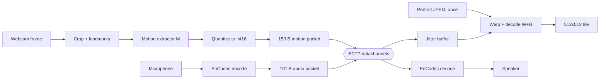
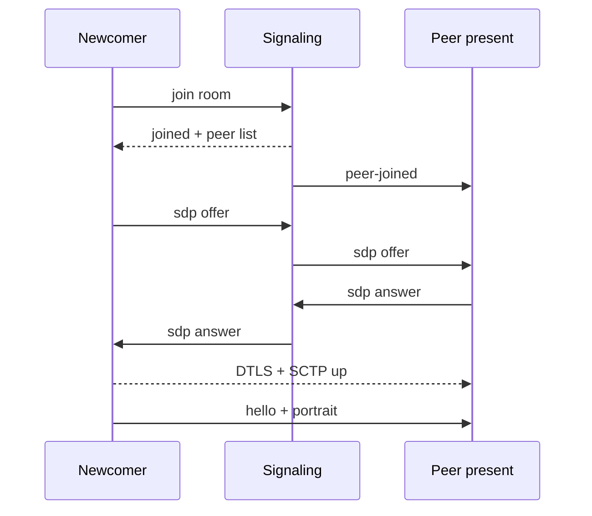

# LivePortrait Conference Pipeline

One participant costs about 24 kbps of video and 6.4 kbps of audio, because
nothing resembling video is ever transmitted: the sender ships 21 implicit
keypoints and a head pose as 150 bytes per frame, and the receiver re-renders
the face from a portrait it received once when the call started.

## Pipeline at a glance

After setup, nothing resembling an image leaves the sender. Each webcam frame is
reduced to a head pose and 21 expression deltas, and the receiver rebuilds the
face from a portrait it already holds.

The two media paths stay independent until the receiver, where the audio
playhead decides when each motion packet may render. The portrait enters once,
at call setup, and is what makes the 150-byte steady state possible.

## How WebRTC is used

WebRTC is used for its transport only. No audio or video track is negotiated, so
the SDP carries a single SCTP section and no RTP packet exists anywhere in the
system.

Rooms form a full mesh. The signaling server is a pure websocket relay: it
forwards SDP between members of a room and never sees media. Join order settles
roles without glare handling, because a newcomer gets the list of peers already
present and offers to each of them.

ICE is vanilla rather than trickled. aiortc finishes gathering before
`setLocalDescription` resolves, so candidates travel inside the SDP itself. The
signal handler still accepts a separate `ice` message from a peer that trickles,
but this client never sends one: `candidate_to_sdp` is imported and unused. STUN
defaults to Google's public server, and `--turn` adds a relay, which is the only
path that works on networks with client isolation.

All four channels are pre-negotiated with fixed stream ids, so both ends agree
on the layout with no DCEP round trips:

| id | Channel | Reliability | Carries |
| --- | --- | --- | --- |
| 1 | `ctrl` | reliable, ordered | JSON hello and bye |
| 2 | `blob` | reliable, ordered | the avatar JPEG, in 8 KiB chunks |
| 3 | `motion` | unreliable, unordered | 150-byte motion vectors |
| 4 | `audio` | ordered, 300 ms lifetime | EnCodec chunks |

Motion and audio are deliberately lossy: retransmitting a 50 ms-old pose costs
more than skipping it.

## The first frame: sending your portrait

The portrait is the only keyframe in the system, and it is sent exactly once per
peer over the reliable channel.

At startup the image named by `--avatar` is loaded, resized so its longest side
is at most 720 px, and JPEG-encoded at quality 90 — typically a few tens of
kilobytes. `pack_blob` splits it into 8 KiB chunks, each carrying a 7-byte header
with the blob id, the chunk index and the total. `BlobReassembler` on the far
side collects them and returns the payload when the last one lands.

Delivery is timed against the channels, not the connection. `connectionState`
reaches `connected` when DTLS completes, but the SCTP association — and so the
datachannels — opens a round trip later, and anything sent in between is dropped
silently. The greeting therefore waits for `ctrl` and `blob` to both report
`open`, retrying every 500 ms for up to 20 seconds. A lost motion packet is one
skipped frame; a lost portrait is a participant who stays a grey tile for the
rest of the call.

Receiving it pays the only expensive setup in the system, so it runs on its own
thread: the JPEG is decoded, the face cropped, and the appearance volume `f_s`
and transformed source keypoints `x_s` computed once. Every later frame for that
peer is warp and decode alone.

This is also why there is no keyframe interval and no drift. An H.264 P-frame is
a delta against the previously decoded frame, so loss propagates until the next
I-frame arrives. Here every motion packet is an absolute pose composed against
the portrait and a neutral reference — established by the first packet of a
stream, or any packet carrying the calibrate flag that the `r` key sets. A lost
packet costs one frame and nothing after it.

## Video path: a face becomes 70 numbers

Only the motion extractor runs on the sender. Identity never travels: the
receiver already holds the canonical keypoints from the portrait, so the wire
carries pose and expression alone.

A camera thread keeps only the newest frame, and the capture loop paces itself to
`--fps` (20 by default) rather than to the camera. Each frame is cropped to the
face at 256×256 before anything else runs. Full detection runs every 30th frame;
in between, the landmark model is anchored on the previous frame's landmarks,
which is far cheaper. `--no-crop` skips detection entirely and resizes the whole
frame, which only works when the face already fills it.

The crop goes through `prepare_source` and then `get_kp_info`, which is
LivePortrait's motion extractor **M**. What comes back is the whole per-frame
payload:

| Field | Shape | Values | Meaning |
| --- | --- | --- | --- |
| pitch, yaw, roll | scalar × 3 | 3 | head rotation, in degrees |
| scale | scalar | 1 | apparent head size |
| t | (3,) | 3 | translation in keypoint units |
| exp | (21, 3) | 63 | expression delta per implicit keypoint |
| | | **70** | 140 bytes once quantised |

The receiver composes those against the keypoints it derived from the portrait,
using the same relative-motion equation as the offline LivePortrait pipeline:

$$R_{new} = R_d\,R_{ref}^{\top}\,R_s$$

$$x_d = s_{new}\,(x_{c,s}\,R_{new} + \delta_{new}) + t_{new}$$

$x_{c,s}$ is the receiver's own canonical keypoints and never crosses the
network. The reference terms are the neutral pose captured from the first packet,
so the sender and receiver need agree on nothing beyond the packets themselves.
Stitching and optional lip normalisation are applied on the receiver as well.

When no face is visible the extractor returns nothing and no packet is sent, so a
participant who steps away costs zero bitrate rather than a frozen frame's worth.

## Resolutions along the path

No resolution is ever transmitted. The camera setting governs only how well the
face can be found, and the picture every participant sees is sized by the
generator, so changing `--width` and `--height` changes nothing on the wire.

| Stage | Size | Set by |
| --- | --- | --- |
| Camera capture | 640×480 | `--width`, `--height` |
| Face crop | 512×512 | `CropConfig.dsize` |
| Motion extractor input | 256×256 | downscaled from the crop |
| Portrait on the wire | ≤ 720 px on the long side | `encode_avatar_jpeg(max_dim=720)` |
| Portrait as received | ≤ 1280 px, multiple of 2 | `InferenceConfig.source_max_dim` |
| Renderer source crop | 256×256 | `img_crop_256x256` |
| Generator output | 512×512 | SPADE generator, `upscale: 2` |
| Grid tile on screen | 384×384 | `--tile` |

Two of those carry weight and the rest is plumbing. The 256×256 extractor input
is what the motion vector actually describes, and the 512×512 generator output is
what every participant sees — the sender's camera never sets the receiver's
picture quality.

This is also where comparison with a conventional codec stops being
like-for-like. H.264 at 640×480 costs roughly four times what it costs at
320×240, whereas here 640×480 and 1920×1080 both cost exactly 150 bytes per
frame. A higher capture resolution buys better face tracking, not more bits.

## Quantization: 70 floats into 140 bytes

Every motion field is int16 fixed-point. The value is multiplied by a per-field
scale, rounded to nearest, and clipped into int16 range.

| Field | Scale | Step | Range |
| --- | --- | --- | --- |
| pitch, yaw, roll | 128 | 0.0078° | ±256° |
| scale | 8,192 | 1.22 × 10⁻⁴ | ±4 |
| t | 8,192 | 1.22 × 10⁻⁴ | ±4 |
| exp | 16,384 | 6.10 × 10⁻⁵ | ±2 |

Each scale is picked so the field's real dynamic range fits int16 with room to
spare, and the reciprocal is the quantisation step. Head rotation never
approaches ±256°, so the angle scale is deliberately loose; expression deltas are
the tightest because they are what the eye reads.

Fixed point rather than float16 is a decision about the worst case, not the
typical one. A float16 step grows with magnitude: about 7.6 × 10⁻⁶ near 0.01, but
2.0 × 10⁻³ near the top of the expression range. Fixed point holds
6.10 × 10⁻⁵ everywhere, so across ±2 its worst case is roughly 32 times tighter —
and the worst case is what shows on a face.

The self-test measures the round trip at 3.05 × 10⁻⁵ maximum expression error,
which is half a step, exactly what round-to-nearest should give.

That is 70 values × 2 bytes = 140 bytes, plus a 10-byte header, for a fixed
150-byte packet. At 20 fps one participant's video is 24.0 kbps. The HUD compares
that against roughly 369 kbps for H.264 at 640×480 and 20 fps — a rough yardstick
rather than a measurement, but the order of magnitude is the point.

## Audio path: EnCodec

EnCodec's 24 kHz model is not a streaming codec — it has no framing of its own —
so it is driven in fixed chunks and the raw quantiser codes go straight onto the
wire. No Opus, and no RTP payload format.

The microphone delivers blocks of `--audio-chunk-ms` (240 by default) at the
device's native rate, which is resampled to 24 kHz. Chunk and lookback lengths
are rounded to whole latent frames of 320 samples so the codes line up.

Quantisation here is residual vector quantisation. The encoder's latent runs at
75 Hz, and n_q codebooks of 1,024 entries each are applied in turn to whatever
the previous codebook left over. Each index is therefore 10 bits, and the target
bandwidth simply picks how many codebooks are kept.

| Target | Codebooks | Codes payload | On the wire at 240 ms chunks |
| --- | --- | --- | --- |
| 1.5 kbps | 2 | 1.5 kbps | 1.87 kbps |
| 3 kbps | 4 | 3.0 kbps | 3.37 kbps |
| 6 kbps | 8 | 6.0 kbps | 6.37 kbps |
| 12 kbps | 16 | 12.0 kbps | 12.37 kbps |
| 24 kbps | 32 | 24.0 kbps | 24.37 kbps |

The gap between the last two columns is the 11-byte header, a flat 0.37 kbps at
240 ms chunks. Halving the chunk length doubles that overhead and makes the
encoder's fixed lookback a larger fraction of its work, which is the real cost of
lowering latency.

Encoding each chunk independently would leave a discontinuity at every seam, so
the encoder prepends 80 ms of the previous audio as context and then drops those
latent frames from the output. The decoder crossfades successive chunks, and a
mixer sums every peer into one output stream, each peer holding its own ring
buffer so a stalled participant starves only themselves.

## Packet formats on the wire

There are three packet families, each self-describing through a one-byte magic,
so the receive handler dispatches on the first byte with no negotiation. All
integers are little-endian and a version byte guards against mismatched builds.

| Family | Size | Header | Payload |
| --- | --- | --- | --- |
| motion `M` | 150 B fixed | 10 B: magic, version, seq (u16), t_ms (u32), flags, n_kp | 70 × int16 |
| audio `A` | 11 B + codes | 11 B: magic, version, seq (u16), t_ms (u32), n_q, n_frames (u16) | n_q × n_frames codes at 10 bits |
| blob `B` | 7 B + ≤ 8 KiB | 7 B: magic, version, blob_id, chunk (u16), total (u16) | a slice of the JPEG |

Both media families carry `t_ms`, a 32-bit millisecond counter taken from the
sender's `time.monotonic()`. It is the same clock in both streams, which is what
makes synchronisation possible without exchanging clocks at all. It wraps every
49.7 days, so every comparison uses a wrap-safe signed difference rather than
plain subtraction.

The motion flags byte currently holds one bit, `FLAG_CALIBRATE`, meaning "treat
this frame as the new neutral reference". The `n_kp` byte lets a receiver reject
a peer built with a different keypoint count instead of decoding nonsense.

Audio codes are bit-packed at 10 bits each and laid out frame-major, so a
truncated packet still decodes a prefix of time rather than a prefix of
codebooks.

## Transmission: threads, channels and fan-out

Torch never runs on the event loop. Every expensive step owns a thread and hands
finished buffers across with `call_soon_threadsafe`, so a slow GPU or a slow
encoder cannot stall ICE or the datachannels.

| Thread | Owns | Does |
| --- | --- | --- |
| main | the OpenCV window | composes tiles, reads keys |
| asyncio loop | aiortc and SCTP | signaling, every send and receive |
| capture | camera, extractor M | crop, extract, quantise, hand off |
| render | the GPU | warp + decode, one peer per turn |
| audio encode | EnCodec encoder | mic chunk → codes → hand off |
| audio decode | EnCodec decoder | codes → PCM → speaker buffer |

A packet's path out is worker thread, then `call_soon_threadsafe`, then
`channel.send`, then SCTP over DTLS over UDP, on whichever candidate pair ICE
selected — host, server-reflexive through STUN, or a TURN relay. Inbound is the
mirror: aiortc raises the message on the loop thread, the packet is unpacked
there, and the result is dropped into a per-peer structure that a worker drains,
so decoding and rendering never block the loop.

The room is a full mesh, so every packet is sent once per peer. The HUD counts a
packet once, because that per-stream figure is the one comparable to a codec's
bitrate; actual uplink is that figure times the number of remote peers. At
24 kbps of video plus 6.4 kbps of audio, a four-person call costs roughly
91 kbps upstream, which is why a mesh is viable here at all.

Backpressure differs per channel. Motion checks `bufferedAmount` and skips the
frame when more than 64 KiB is already queued, because a queued pose is a stale
pose. Audio needs no such check, since SCTP discards it after 300 ms of life. The
two reliable channels have no backpressure at all, which is fine when they carry
one JPEG per peer per call.

## Audio/video synchronisation

Audio is the master clock, because the speaker drains at a rate nothing in the
application controls. Both streams carry `t_ms` from the same sender clock, so
they compare directly with no clock exchange at all.

When a decoded chunk is pushed into a peer's ring buffer, the backlog already
sitting there plus the device's own output latency is exactly how long until that
chunk becomes audible. Anchoring the chunk's capture timestamp to that instant
yields a live estimate of which capture moment the listener is hearing.
Re-anchoring on every chunk absorbs codec padding, mixer underruns and clock
drift between the two machines, so none of it accumulates.

Both timestamps have to mark the right instant. The microphone callback fires
only once a whole block is captured, so the audio stamp is back-dated to that
block's first sample; motion is stamped at the frame grab rather than after
extraction. Getting either wrong shifts a whole stream by a chunk length or by
the extraction time.

Motion then waits in a per-peer queue until its capture instant reaches the
playhead. A queue rather than a one-deep mailbox is the load-bearing detail:
video always arrives ahead of the audio it belongs with, so keeping only the
newest packet and waiting for it to fall due would replace it on every tick and
never render anything.

Two refinements matter. The pick aims at where the playhead will be once warp and
decode have finished, using the last render's measured cost — on CPU that is the
difference between lip sync and a face a beat behind the voice. And the 10 ms
slack is deliberately small, because it lands entirely on the leading side, where
ITU-R BT.1359 puts the tolerance at roughly +45 ms against −125 ms.

A peer sending no audio offers no clock to sync against, so their video renders
on arrival instead of waiting for a playhead that never comes. Stage 2 of the
self-test steps a whole call through the buffer at head starts from 0 to 600 ms
and asserts that nothing freezes.

## Differences from standard WebRTC

Only the connection machinery is standard. Signaling, ICE, DTLS and SCTP are used
exactly as any WebRTC application would; everything above them is replaced.

| Concern | Standard WebRTC | This system |
| --- | --- | --- |
| Media transport | RTP/SRTP on negotiated audio and video m-lines | SCTP datachannels; no media section is negotiated |
| Video codec | H.264, VP8/9, AV1 — intra and inter frames | 70 motion values against a portrait sent once |
| Video rate at 640×480, 20 fps | ~370 kbps | 24 kbps, fixed |
| Audio codec | Opus in an RTP payload format | EnCodec RVQ codes, raw on a datachannel |
| Loss of one media packet | P-frames break until a PLI forces a keyframe | one skipped frame, nothing after it |
| A/V sync | RTCP Sender Reports map each RTP clock to NTP | one shared monotonic clock inside both payloads |
| Jitter buffer | NetEq plus an adaptive video buffer with jitter estimation | fixed queue paced by the audio playhead |
| Congestion control | transport-wide CC, bandwidth estimation, adaptive rate | none; fixed rate, frames skipped under backpressure |
| Loss recovery | NACK, RED, FEC, packet loss concealment | none; drop and continue |
| Where the cost sits | expensive to encode, cheap to decode | cheap to encode, expensive to decode |

That last row is the real inversion. A conventional endpoint spends its budget
encoding and can decode several streams cheaply, which is why an SFU can forward
many participants to one client. Here the sender runs one extractor pass while
the receiver runs a warp-and-decode per peer per frame, so room size is bounded
by the receiver's GPU rather than by bandwidth — and an SFU cannot relieve it,
because there is nothing to forward but 150-byte packets that still have to be
rendered somewhere.

Three absences are worth stating plainly. There is no congestion control, so the
stream does not yield to competing traffic; at 30 kbps that is defensible, and at
1 Mbps it would not be. There is no loss recovery of any kind. And there is no
interoperability: a browser or any standard endpoint cannot join, because both
ends must run this application to hold the portrait and the networks.

What is gained is the semantic-communication property. The wire carries what the
face is *doing* — pose and expression — while identity stays on the receiver as a
portrait transferred once, so bitrate scales with motion rather than with pixels.
